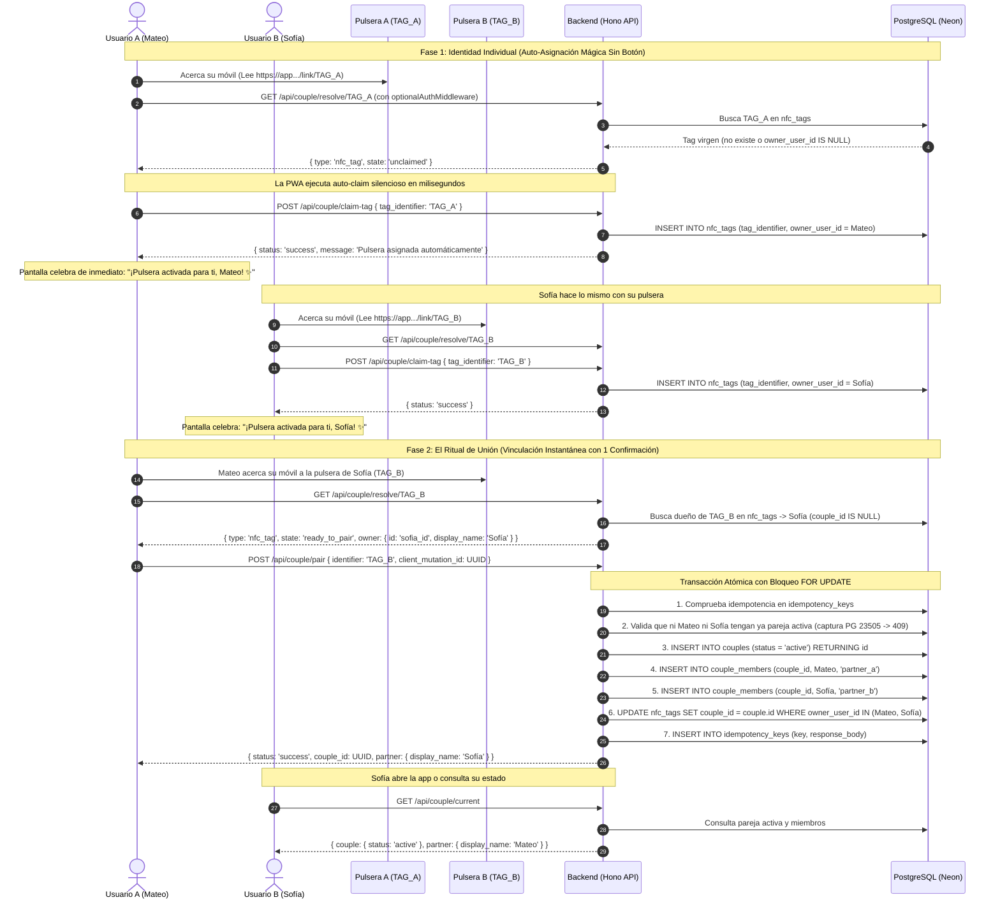

# Plan de Implementación — Backend Hito 2: Emparejamiento y Tags NFC (`feature/couple`)

Este documento define la arquitectura, contratos compartidos, flujo de datos y desarrollo del **Backend** para el Hito 2, incorporando auto-asignación sin botones, resolución de todos los gaps bloqueantes y las reglas de tipado e inferencia acordadas.

---

## 1. Flujo de Dominio y Secuencia de Emparejamiento



---

## 2. Decisiones Clave y Resolución de Gaps

| # | Gap / Decisión | Solución Técnica en Backend |
| :--- | :--- | :--- |
| **1** | **Migración formal de Schema** | Modificar `server/db/schema.ts` y generar migración versionada `drizzle/migrations/0002_*.sql` con `pnpm db:generate`. Aplicar a PostgreSQL local con `pnpm db:migrate`. |
| **2** | **Mapeo de Error PG 23505** | Capturar `error?.code === '23505' \|\| error?.cause?.code === '23505'` en `couple.repository.ts` / `couple.service.ts` y mapearlo a `CoupleConflictError` $\rightarrow$ respuesta HTTP `409 Conflict`. |
| **3** | **Fuente única de verdad en `shared/`** | `ClaimTagInputSchema` reside canónicamente en `shared/schemas/couple.schema.ts`. En `common.schema.ts` se reexporta `ResolveNfcTagInputSchema = ClaimTagInputSchema`. En `shared/index.ts` se exporta todo el módulo de pareja. |
| **4** | **Provisioning JIT e Inferencia de Tipo** | En `couple.service.ts`: si un identificador no existe en BD, se evalúa por formato: si coincide con `/^LZ-[A-Z0-9]{4,8}$/i` se infiere como `{ type: 'digital_invite', state: 'invalid' }`. Si no coincide, se infiere como `{ type: 'nfc_tag', state: 'unclaimed' }`. |
| **5** | **Limpieza en Tests (`truncateAuthTables`)** | Añadir `nfc_tags` y `couple_invitations` a la sentencia `TRUNCATE TABLE ... CASCADE;` en `tests/helpers/db.ts`. |
| **6** | **Montaje de Rutas en `server/index.ts`** | Montar formalmente `app.route('/api/couple', coupleRouter)`. |
| **7** | **`optionalAuthMiddleware`** | Crear middleware no bloqueante que extraiga el usuario si hay cookie de sesión válida, pero que permita continuar a usuarios anónimos sin rechazar 401. |

---

## 3. Esquema de Base de Datos (`server/db/schema.ts`)

### 3.1 Índices en `nfc_tags` (Tabla Existente)
```typescript
export const nfcTags = pgTable(
  'nfc_tags',
  {
    id: uuid('id').defaultRandom().primaryKey(),
    tagIdentifier: varchar('tag_identifier', { length: 128 }).unique().notNull(),
    coupleId: uuid('couple_id').references(() => couples.id, { onDelete: 'cascade' }),
    ownerUserId: uuid('owner_user_id').references(() => users.id, { onDelete: 'set null' }),
    lastTappedAt: timestamp('last_tapped_at', { withTimezone: true }),
    createdAt: timestamp('created_at', { withTimezone: true }).defaultNow().notNull(),
  },
  (t) => [
    index('idx_nfc_tags_owner').on(t.ownerUserId),
    index('idx_nfc_tags_couple').on(t.coupleId),
  ]
)
```

### 3.2 Nueva Tabla: `couple_invitations` (Respaldo Digital)
```typescript
export const invitationStatusEnum = pgEnum('invitation_status', [
  'pending',
  'accepted',
  'revoked',
  'expired',
])

export const coupleInvitations = pgTable(
  'couple_invitations',
  {
    id: uuid('id').defaultRandom().primaryKey(),
    inviterUserId: uuid('inviter_user_id')
      .references(() => users.id, { onDelete: 'cascade' })
      .notNull(),
    coupleId: uuid('couple_id')
      .references(() => couples.id, { onDelete: 'cascade' }),
    invitationCode: varchar('invitation_code', { length: 64 }).unique().notNull(),
    status: invitationStatusEnum('status').default('pending').notNull(),
    expiresAt: timestamp('expires_at', { withTimezone: true }).notNull(),
    acceptedByUserId: uuid('accepted_by_user_id')
      .references(() => users.id, { onDelete: 'set null' }),
    acceptedAt: timestamp('accepted_at', { withTimezone: true }),
    createdAt: timestamp('created_at', { withTimezone: true }).defaultNow().notNull(),
  },
  (t) => [
    index('idx_couple_invitations_code').on(t.invitationCode),
    index('idx_couple_invitations_inviter').on(t.inviterUserId),
  ]
)
```

---

## 4. Contratos Compartidos Zod (`shared/schemas/couple.schema.ts`)

```typescript
import { z } from 'zod'

// 1. DTO de Resolución de Tag o Código (/link/:identifier)
export const ResolveIdentifierResponseSchema = z.object({
  identifier: z.string(),
  type: z.enum(['nfc_tag', 'digital_invite']),
  state: z.enum([
    'unclaimed',       // Tag libre -> PWA auto-reclama en segundo plano sin botones
    'owned_by_me',     // Pulsera del propio usuario autenticado
    'ready_to_pair',   // Pulsera o invitación del partner -> Listo para confirmar unión
    'already_paired',  // Ya pertenece a una pareja activa
    'invalid',         // Código inexistente o caducado
  ]),
  owner: z
    .object({
      id: z.string().uuid(),
      display_name: z.string(),
      avatar_url: z.string().nullable(),
    })
    .nullable(),
})

export type ResolveIdentifierResponse = z.infer<typeof ResolveIdentifierResponseSchema>

// 2. DTO Canónico para Reclamar Tag Físico (Fuente única)
export const ClaimTagInputSchema = z.object({
  tag_identifier: z.string().min(1).max(128),
})

export type ClaimTagInput = z.infer<typeof ClaimTagInputSchema>

// 3. DTO para Vincular Pareja (Transacción Atómica con Idempotencia)
export const PairCoupleInputSchema = z.object({
  client_mutation_id: z.string().uuid(),
  identifier: z.string().min(1).max(128), // tag_identifier o invitation_code
})

export type PairCoupleInput = z.infer<typeof PairCoupleInputSchema>

export const PairCoupleResponseSchema = z.object({
  status: z.literal('success'),
  couple_id: z.string().uuid(),
  partner: z.object({
    id: z.string().uuid(),
    display_name: z.string(),
    avatar_url: z.string().nullable(),
  }),
})

export type PairCoupleResponse = z.infer<typeof PairCoupleResponseSchema>

// 4. DTO para Crear Código Digital de Respaldo
export const CreateInviteCodeResponseSchema = z.object({
  invitation_code: z.string(),
  expires_at: z.string(),
})

export type CreateInviteCodeResponse = z.infer<typeof CreateInviteCodeResponseSchema>

// 5. DTO de Consulta de Pareja Actual
export const CurrentCoupleResponseSchema = z.object({
  couple: z
    .object({
      id: z.string().uuid(),
      status: z.enum(['pending', 'active', 'paused', 'archived']),
      anniversary_date: z.string().nullable(),
      created_at: z.string(),
    })
    .nullable(),
  partner: z
    .object({
      id: z.string().uuid(),
      display_name: z.string(),
      avatar_url: z.string().nullable(),
    })
    .nullable(),
  my_tags: z.array(
    z.object({
      id: z.string().uuid(),
      tag_identifier: z.string(),
      last_tapped_at: z.string().nullable(),
    })
  ),
})

export type CurrentCoupleResponse = z.infer<typeof CurrentCoupleResponseSchema>
```

---

## 5. Arquitectura de Backend (`server/features/couple/`)

### 5.1 `couple.repository.ts`
- `findTagByIdentifier(tagIdentifier)`: Busca en `nfc_tags`.
- `claimTagForUser(tagIdentifier, userId)`: Inserta o asocia tag libre a `userId`.
- `findActiveCoupleByUserId(userId)`: Devuelve la pareja activa, el partner y los tags asociados.
- `findUserMembership(userId)`: Comprueba si un usuario ya pertenece a alguna pareja en `couple_members`.
- `findInvitationByCode(code)`: Busca en `couple_invitations`.
- `createInvitation(inviterUserId, code, expiresAt)`: Inserta en `couple_invitations`.
- `executeAtomicPairing(identifier, acceptorUserId, clientMutationId)`:
  - Manejo previo de `idempotency_keys`.
  - Bloqueo de filas con `FOR UPDATE`.
  - Captura y traducción de `code === '23505'` a `CoupleConflictError`.
  - Inserción atómica en `couples` y `couple_members` (`partner_a` y `partner_b`).
  - Actualización masiva de `nfc_tags` asociando ambas pulseras al `couple_id`.

### 5.2 `couple.service.ts`
- **Inferencia inteligente de formato para desconocidos:**
  - Si no existe en BD y cumple `/^LZ-[A-Z0-9]{4,8}$/i` $\rightarrow$ `{ type: 'digital_invite', state: 'invalid' }`.
  - Si no existe en BD y no cumple el patrón $\rightarrow$ `{ type: 'nfc_tag', state: 'unclaimed' }`.
- Orquestación de auto-claim, control de expiración de invitaciones digitales y generación de códigos `LZ-XXXX`.

### 5.3 `couple.routes.ts`
- `GET /api/couple/resolve/:identifier` (Usa `optionalAuthMiddleware`).
- `POST /api/couple/claim-tag` (Auth obligatorio con `authMiddleware`).
- `POST /api/couple/pair` (Auth obligatorio + Idempotencia).
- `GET /api/couple/current` (Auth obligatorio).
- `POST /api/couple/invite-code` (Auth obligatorio).

---

## 6. Plan de Pruebas Automatizadas (`tests/api/couple.pairing.test.ts`)

1. **JIT Auto-discovery de Tag:** Resolver un identificador que no existe en BD devuelve `{ type: 'nfc_tag', state: 'unclaimed' }`.
2. **Inferencia de Código Inválido:** Resolver un código inexistente con formato `LZ-XXXX` devuelve `{ type: 'digital_invite', state: 'invalid' }`.
3. **Auto-claim de tag:** `POST /api/couple/claim-tag` asocia el tag a `owner_user_id = A`.
4. **Reconocimiento de tag propio:** A consulta su propio tag $\rightarrow$ `state: 'owned_by_me'`.
5. **Detección de pareja:** B consulta el tag de A $\rightarrow$ `state: 'ready_to_pair'` con datos de A.
6. **Vinculación Atómica (1 Confirmación):** B llama a `POST /api/couple/pair` con el tag de A:
   - Crea 1 pareja en `couples`.
   - Inserta exactamente 2 miembros en `couple_members`.
   - Asocia ambas pulseras al `couple_id`.
7. **Idempotencia:** Reintento con el mismo `client_mutation_id` devuelve 200 con la misma respuesta sin duplicados.
8. **Anti-autovinculación:** A intenta vincularse consigo mismo $\rightarrow$ 400 Bad Request.
9. **Mapeo PG 23505 a 409 (Inviter ocupado):** Si A ya tiene pareja activa, B es rechazado con 409 Conflict.
10. **Mapeo PG 23505 a 409 (Acceptor ocupado):** Si B ya tiene pareja activa, es rechazado con 409 Conflict.
11. **Respaldo Digital:** Generación de código `LZ-XXXX`, resolución y vinculación exitosa.
12. **Aislamiento de Tests:** Confirmar que `truncateAuthTables` purga `nfc_tags` y `couple_invitations`.
